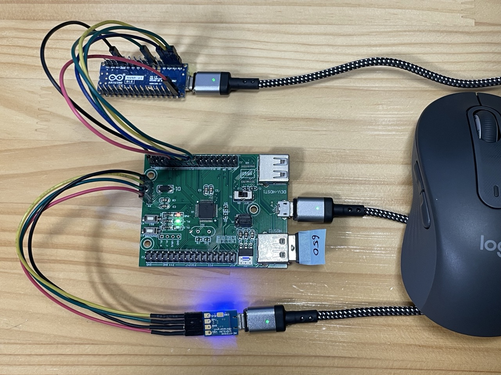

# CH559 USB Mouse Host

**English** · [日本語](README.ja.md)

Firmware that turns a WCH **CH559** into a USB host: it enumerates a USB mouse,
parses its HID reports to extract buttons / X / Y / wheel / horizontal wheel
(Consumer AC Pan), streams that state out over an **SPI0 slave**, and prints
human-readable debug logs on **UART0**.



> **Using it with a ZMK keyboard**: the ZMK input module that consumes this
> firmware's SPI output is [zmk-ch559-spi](https://github.com/tadakado/zmk-ch559-spi)
> — it lets a wireless keyboard use a USB mouse as a pointing device.

## License & Attribution

This project is distributed under the **GNU General Public License v3.0
(GPL-3.0-only)**.

That's because it incorporates and modifies the peripheral / USB-host
enumeration code from its upstream,
[atc1441/CH559sdccUSBHost](https://github.com/atc1441/CH559sdccUSBHost)
(**GPLv3**). Within `src/`, the files `CH559.h` / `util.{c,h}` / `uart.{c,h}` /
`USBHost.{c,h}` come from that repository (`USBHost.c` is modified for this
project), and the whole firmware that links against them is a GPLv3 derivative.
Each file's SPDX header records its origin.

- Full text: [`LICENSE`](LICENSE) (GPLv3)
- Upstream: atc1441 — https://github.com/atc1441/CH559sdccUSBHost
- The register definitions in `CH559.h` originate from WCH and were redistributed
  by atc1441 under GPLv3.

> Note: `hid_parser.{c,h}` is an independent, hardware-agnostic implementation
> that doesn't depend on the GPL code, but as part of this repository's combined
> work it is distributed under GPLv3.

## Layout

| Path | Role |
|---|---|
| `src/hid_parser.{c,h}` | HID report-descriptor parser (original; host-testable) |
| `src/spi_out.{c,h}` | SPI0 slave output (original) |
| `src/main.c` | Entry point (original) |
| `src/USBHost.{c,h}`, `util.*`, `uart.*`, `CH559.h` | From atc1441 (enumeration / polling / peripherals) |
| `test/test_hid_parser.c` | Host-side unit test |
| `tools/serial_monitor.py` | UART monitor (auto-detects the port) |
| `tools/ch559_spi_check/` | SPI receive-check sketch for Arduino Nano 33 BLE (nRF52840) |
| `tools/ch559_spi_check_xiao/` | SPI receive-check sketch for Seeed XIAO nRF52840 Plus |
| `tools/ch559_spi_check_burst/` | Verification sketch that throttles reads and counts button-press edges (to check for dropped clicks) |

See [`SPEC.md`](SPEC.md) for the detailed specification / integration guide.

## Pinout (CH559, 3.3 V)

| Function | CH559 pin | Dir | Notes |
|---|---|---|---|
| Debug UART0 TXD | **P0.2** | out | Alternate pin (`initUART0(baud, 1)`). 115200 baud |
| Debug UART0 RXD | **P0.3** | in | Alternate pin. Receiving `kb\n` enters ISP (bootloader) |
| SPI0 SCK | **P1.7** | in | Clock from the master |
| SPI0 MISO | **P1.6** | out | Frame output (driven automatically while chip-selected) |
| SPI0 MOSI | **P1.5** | in | Unused in this application |
| SPI0 SCS / CS | **P1.4** | in | Chip select (active low) |
| DRDY | **P1.3** | out | Data ready (active low) |
| DOWNLOAD / boot button | **P4.6** | in | Low enters the bootloader (ISP) |
| USB host | 2 root ports (HUB0/HUB1) | — | Built-in USB PHY. Direct connection only (no external hub) |

Connect to the SPI master (e.g. nRF52840) at 3.3 V directly. Wiring examples for
Arduino Nano 33 BLE / Seeed XIAO nRF52840 Plus (a pin table covering all three
boards) are in [`SPEC.md`](SPEC.md) §6.

## Build / flash / test

Toolchain: SDCC 4.5 / wchisp 0.3 / uv (pyserial) / GNU Make (verified on macOS).

```bash
make                       # build (output in build/, with UART debug logging)
make clean && make RELEASE=1   # production build: strip all UART debug output
make clean && make RAW=1   # debug build: add a RAW hex dump of each report to UART
make test                  # host unit test for hid_parser
make flash                 # flash with wchisp (requires ISP mode)
uv run --with pyserial tools/serial_monitor.py   # UART monitor (auto-detect port, 115200)
```

UART output is on by default (`M b=.. dx=.. dy=.. w=.. hw=..`, etc.). With `RAW=1`
each line is prefixed with `RAW len=.. <hex>`. **`RELEASE=1` removes the per-report
UART debug output at compile time** (that `printf` blocks the main loop for
~2–3 ms at 115200 baud, so it's disabled for production). The **startup banner
(below) is printed in every build** (it's one-shot and free, and is handy for a
liveness / baud-rate / build check). SPI output and `kb`-triggered ISP entry stay
enabled under RELEASE. `make clean` is required when switching `RELEASE` / `RAW`.

At startup it prints this banner to UART0 (with `__DATE__` / `__TIME__` and the
`DEBUG` / `RAW` / `RELEASE` build kind):

```
=== CH559 USB Mouse Host ===
build Jun 11 2026 09:40:12 [DEBUG]  uart 115200 8N1  SPI0 slave 10B
ready
```

See `SPEC.md` §2 (entering ISP / bootloader) and §6 (verified setups).

## SPI output (master = nRF52840 / ZMK)

A 10-byte frame:
```
[0xAA][btnL][btnH][dxL][dxH][dyL][dyH][wheel][hwheel][XOR]
```
- `buttons`, `dx`, `dy`: 16-bit little-endian (`dx`/`dy` signed, up to 16 buttons); `wheel`, `hwheel`: signed 8-bit
- `XOR` = XOR of all preceding bytes (byte0..byte8)

Characteristics:
- **Interrupt-driven and non-blocking** (`bS0_IE_BYTE`). SPI0 slave, mode 0 / MSB first.
- **Delta accumulation**: `dx`/`dy`/`wheel`/`hwheel` accumulate (saturating) until
  read; `buttons` holds the latest value (so nothing is lost).
- **DRDY (P1.3, active low)**: asserted while an unread frame exists. It re-arms
  only **after the master raises CS**, so a frame never changes mid-read.

Master-side protocol (a guide for a ZMK custom input driver):
1. Detect DRDY = low → pull CS low.
2. **Read 10 bytes** → check `byte0 == 0xAA` (sync) and the XOR → decode.
   The first byte is the sync byte (0xAA) emitted from the slave's `SPI0_S_PRE`,
   so it's already aligned (no discard / re-sync needed).
3. Raise CS. If new data exists, DRDY goes low again.

Verification (checked on real hardware, 3.3 V direct):
- Using `tools/ch559_spi_check/` (Arduino Nano 33 BLE = nRF52840) and
  `tools/ch559_spi_check_xiao/` (Seeed XIAO nRF52840 Plus) as the SPI master,
  flashed via `arduino-cli`, doing a DRDY-triggered 10-byte read and confirming
  that movement, buttons, and the vertical/horizontal wheel all match. Pin
  connections are in [`SPEC.md`](SPEC.md) §6.
- `tools/ch559_spi_check_burst/` (Nano 33 BLE) throttles reads to 150 ms and
  counts press edges (bit 0→1) — it confirms that a complete single click that
  happens between reads still arrives (a press frame followed by a release frame)
  and isn't dropped. Wiring is the same as `ch559_spi_check`.
